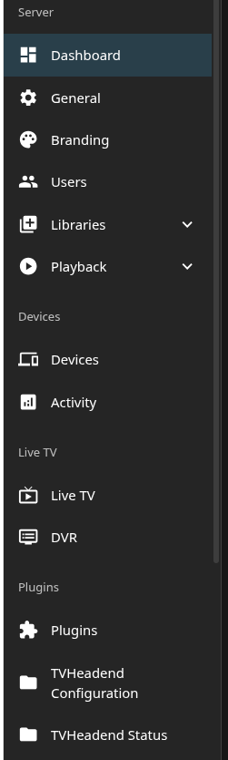
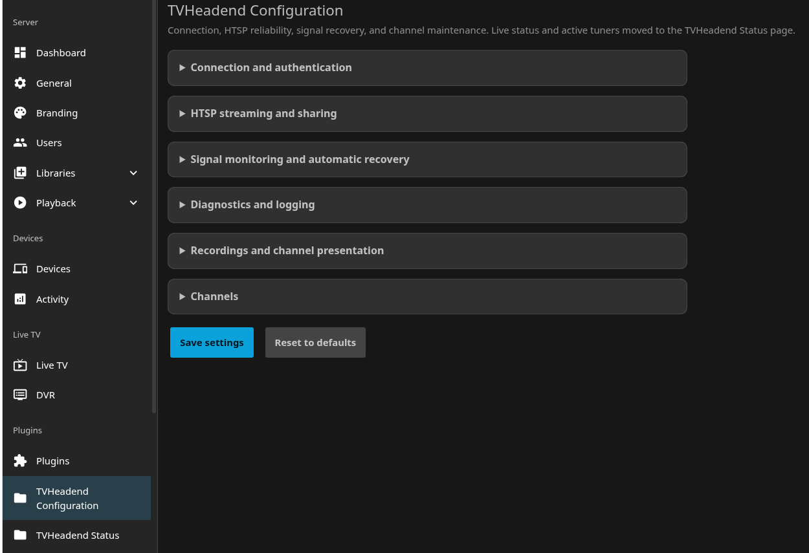
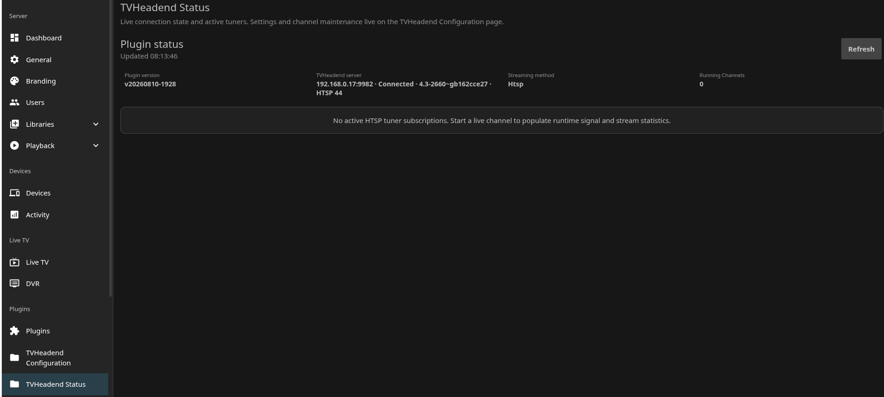

# TvheadEndNew (Jellyfin TVHeadend Plugin Fork)

This repository is a fork of the official
[jellyfin/jellyfin-plugin-tvheadend](https://github.com/jellyfin/jellyfin-plugin-tvheadend)
plugin, packaged under its own plugin identity as **TvheadEndNew** (distinct
name and GUID from upstream). It adds local work aimed at newer Jellyfin
builds, more reliable HTSP playback, and better diagnostics.

Because it uses its own GUID, TvheadEndNew can be installed alongside the
official upstream TVHeadend plugin without conflict.

## What It Includes

- Jellyfin Live TV backed by TVHeadend channels, EPG data, timers, series
  timers, and recordings.
- TVHeadend recording management from Jellyfin, including DVR profiles,
  priorities, pre/post padding, and an optional synthetic "TVHeadend Recordings"
  channel.
- Streaming through HTSP, HTTP ticket URLs, or HTTP basic authentication.
- HTSP direct streaming with shared upstream subscriptions, independent buffered
  readers, clean-keyframe startup, optional initial tune buffering, and a silent
  stream watchdog.
- An in-plugin MPEG-TS muxer for HTSP payloads, including common video, audio,
  DVB subtitle, teletext, and private/fallback stream handling.
- Signal monitoring and recovery for HTSP streams, including lock/SNR/UNC
  tracking, damaged video withholding until a clean keyframe, and bounded
  reconnects.
- Two separate plugin pages, so live status polling never touches the
  settings form: **TVHeadend Configuration** (connection, HTSP, signal
  recovery, and channel maintenance settings) and **TVHeadend Status**
  (read-only runtime status and active tuners).
- Runtime status on the Status page: connection state, active tuners, reader
  counts, signal metrics, queue health, drops, reconnects, startup cache
  state, and per-stream packet/event counters, refreshed every 5 seconds.
- A "Channels" section on the Configuration page with two admin actions:
  "Rebuild channels" (reconnects to TVHeadend so it resends its full channel
  list, removes channels no longer present on TVHeadend, and best-effort
  queues Jellyfin's own Live TV guide/channel refresh task so newly added
  channels are picked up) and "Clear channel logo cache" (force re-downloads
  all cached channel logos, ignoring retention/fingerprint checks).
- One dual-targeted codebase (`net9.0` for Jellyfin 10.11.x, `net10.0` for
  Jellyfin 12.0.x) so both server lines get identical features from the same
  commit — nothing is held back for either ABI.

## Requirements

TvheadEndNew targets whatever Jellyfin actually ships. As of this writing
that's two lines — Jellyfin has no `11.x`; the project went straight from
`10.11.11` (its last `10.x` release) to `12.0` (currently `12.0-rc4`, not yet
stable):

| Jellyfin server        | Plugin version | targetAbi     | Built with              |
|-------------------------|-----------------|---------------|--------------------------|
| `12.0.x` (incl. RCs)    | `2.4.3.0`       | `12.0.0.0`    | `net10.0` SDK            |
| `10.11.x`               | `1.1.0.0`       | `10.11.0.0`   | `net9.0` SDK             |

The repository manifest publishes both versions; Jellyfin's plugin
catalogue automatically shows whichever one is ABI-compatible with your
server, so you always add the same repository URL regardless of which
Jellyfin version you run. TVHeadend itself needs HTTP and HTSP access
enabled.

`master` builds **both** lines from the same source: `TVHeadEnd.csproj` is
dual-targeted (`<TargetFrameworks>net9.0;net10.0</TargetFrameworks>`), with
the `Jellyfin.Controller` package version and the assembly's own version
number picked per target framework. There's no separate tag to check out —
every release ships both builds from the same commit, so the 10.11.x line is
never missing a feature the 12.0.x line has.

## Installation

### Via plugin repository (recommended)

1. In Jellyfin, go to **Dashboard → Plugins → Catalogue**.
2. Click **Manage Repositories**.
3. Click the **+** button to add a new repository.
4. Enter a name (e.g. `TvheadEndNew`) and this URL:

   ```text
   https://neilmanfredit.github.io/jellyfin-plugin-tvheadend/manifest.json
   ```

5. Click **Save**.
6. Return to **Dashboard → Plugins → Catalogue** and search for
   **TvheadEndNew** (Live TV category), install it, and restart Jellyfin.

Jellyfin filters the catalogue by ABI compatibility. The manifest currently
publishes two versions: `2.4.3.0` (`targetAbi 12.0.0.0`, for Jellyfin 12.x
servers) and `1.1.0.0` (`targetAbi 10.11.0.0`, for Jellyfin 10.11.x servers)
— your server will only see the one it's compatible with, and both carry the
same feature set. Packaged releases are published under
[Releases](https://github.com/neilmanfredit/jellyfin-plugin-tvheadend/releases).

### Manual build

```powershell
dotnet publish --configuration Release --output bin
```

Then copy the built `TVHeadEnd.dll` into Jellyfin's `plugins/tvheadend` folder
and restart Jellyfin.

## Configuration Notes

The settings page lets you configure the TVHeadend host, HTTP/HTSP ports, HTTPS,
web root, credentials, timezone, streaming method, recording profile, and HTSP
reliability options.

HTSP is the default streaming method in this fork. HTTP ticket/basic streaming is
still available when you want TVHeadend to provide the transport stream directly.

TVHeadend channels are only imported once their service type maps to TV or
Radio. Channels tagged "other" (or with no active service at all) are
controlled by the "Channels tagged Other" setting - set it to TV or Radio to
include them, or leave it as "Ignore" to exclude them.

## What the Plugin Looks Like

### Plugins menu

TvheadEndNew adds two entries under **Dashboard → Plugins**: TVHeadend
Configuration and TVHeadend Status.



### TVHeadend Configuration

Reached via **Dashboard → Plugins → TvheadEndNew → TVHeadend Configuration**.
A single settings form, organized into collapsible sections:



- **Connection and authentication** — TVHeadend hostname/IP, TVHeadend
  timezone (defaults to auto-detected), HTTP port, "Use HTTPS" toggle, HTSP
  port, web root, username/password, and streaming method (HTSP / HTTP
  ticket / HTTP basic).
- **HTSP streaming and sharing** — shared upstream subscriptions toggle,
  "start new readers at a verified keyframe" toggle, queue depth (MiB),
  initial tune buffer (ms), silent-stream watchdog timeout, and an optional
  HTSP v12+ control-stream filter.
- **Signal monitoring and automatic recovery** — logging toggle for
  meaningful signal changes, an automatic-recovery toggle, and (when
  recovery is enabled) lock-loss threshold, UNC burst threshold,
  clean-keyframe wait, max reconnects/minute, and reconnect cooldown.
- **Diagnostics and logging** — periodic combined HTSP health summaries
  (with interval), and a detailed packet/transport diagnostics toggle for
  troubleshooting.
- **Recordings and channel presentation** — recording priority, TVHeadend
  DVR profile (populated live from TVHeadend), pre/post-recording padding,
  the "Channels tagged Other" TV/Radio/Ignore selector, hide the synthetic
  "TVHeadend Recordings" channel, and an experimental force-deinterlace
  toggle.
- **Channels** — two buttons: **Rebuild channels** (reconnects to TVHeadend
  so it resends its full channel list, removes channels no longer present,
  and best-effort triggers Jellyfin's own guide/channel refresh task) and
  **Clear channel logo cache** (force re-downloads all cached channel
  logos). A status line beneath shows the result of the last action run.
- **Save settings** / **Reset to defaults** buttons at the bottom (reset
  keeps hostname, username, and password).

### TVHeadend Status

Reached via **Dashboard → Plugins → TvheadEndNew → TVHeadend Status**.
Read-only, polls every 5 seconds, and shares no DOM or requests with the
Configuration page:



- A header with a **Refresh** button and a "last updated" timestamp.
- A summary grid of runtime metrics (connection state, reader/subscription
  counts, signal lock/strength/SNR, queue depth, drops, reconnects, and
  similar health figures), each with a small progress-style meter where a
  percentage applies.
- An "active tuners" list — one expandable card per currently-streaming
  channel, showing per-stream packet/event counters, signal badges
  (good/warn/bad), and a details table of individual stream tracks.

## Changelog

- **2.4.3.0 / 1.1.0.0** — Restored full Jellyfin 10.11.x feature parity: the
  project now builds from a single dual-targeted `TVHeadEnd.csproj`
  (`net9.0` for the `10.11.0.0` ABI, `net10.0` for the `12.0.0.0` ABI)
  instead of the 10.11.x line being frozen at the original fork's feature
  set. Every feature added since is now in both builds.

## Building and Releasing

### Installing the .NET SDK

`TVHeadEnd.csproj` dual-targets `net9.0` (Jellyfin 10.11 ABI) and `net10.0`
(Jellyfin 12.0 ABI), so building the full solution needs both the .NET 9 and
.NET 10 SDKs, plus the ASP.NET Core 10.0 runtime (pulled in transitively via
`Jellyfin.Controller`, and required to actually *run* anything built against
it, e.g. `TVHeadEnd.LifecycleChecks`, which targets `net10.0`).

- **Arch / Manjaro**:

  ```bash
  sudo pacman -S dotnet-sdk-9.0 dotnet-sdk-10.0 aspnet-runtime-10.0
  ```

- **Debian / Ubuntu, Fedora, Windows, macOS**: follow Microsoft's official
  install instructions for your platform:
  [dotnet.microsoft.com/download](https://dotnet.microsoft.com/download) —
  or use the [dotnet-install script](https://learn.microsoft.com/dotnet/core/tools/dotnet-install-script)
  for a user-local install with no root/admin needed:

  ```bash
  curl -sSL https://dot.net/v1/dotnet-install.sh | bash -s -- --channel 9.0
  curl -sSL https://dot.net/v1/dotnet-install.sh | bash -s -- --channel 10.0
  ```

Verify with `dotnet --list-sdks` and `dotnet --list-runtimes` — you should
see `9.0.x` and `10.0.x` SDKs, plus `Microsoft.AspNetCore.App 10.0.x`.

### Build

```powershell
dotnet build TVHeadEnd.sln
```

This builds both target frameworks in one pass.

Packaged releases can be produced with
[Jellyfin Plugin Repository Manager](https://github.com/oddstr13/jellyfin-plugin-repository-manager)
using the included `build.yaml`.

Releases are also published manually, once per target framework:

1. `dotnet publish TVHeadEnd/TVHeadEnd.csproj --configuration Release -f net9.0 --output bin/publish-net9`
   and `-f net10.0 --output bin/publish-net10`.
2. Zip each output's `TVHeadEnd.dll` separately (e.g. `TvheadEndNew_1.1.0.0.zip`
   for the `net9.0`/10.11.x build, `TvheadEndNew_2.4.3.0.zip` for the
   `net10.0`/12.0.x build).
3. Create a GitHub release per artifact, each tagged `v<version>`, with its
   zip attached as a release asset.
4. Update `docs/manifest.json` with each new version's `sourceUrl` (the
   release asset URL), MD5 `checksum`, and `timestamp`, then push to `master`
   — GitHub Pages serves it from `/docs` automatically.

## Upstream

This fork is based on the Jellyfin TVHeadend plugin. For upstream issues,
documentation, and contribution guidelines, use the official repository:

[jellyfin/jellyfin-plugin-tvheadend](https://github.com/jellyfin/jellyfin-plugin-tvheadend)

## License

This plugin is distributed under the GNU General Public License v3.0. See
[LICENSE](./LICENSE).
